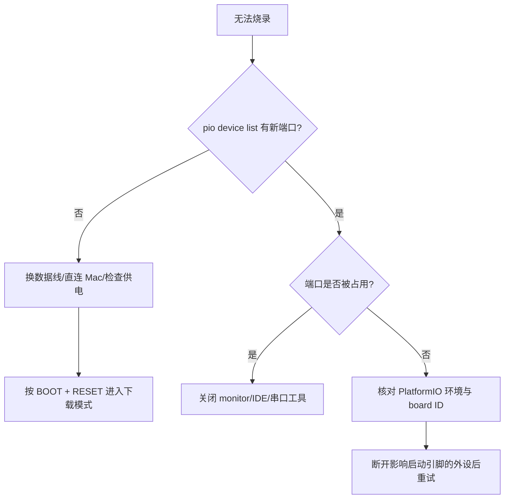

# 调试与故障定位

先保留现场，再改配置。记录目标环境、板卡变体、供电方式、外设连接、完整构建命令和从复位开始的串口日志。

常用命令：

```bash
pio device list
pio device monitor -b 115200
pio run -t clean
pio run -v
```

## 总体排查顺序

1. 确认 USB 数据线具备数据功能。
2. 确认 `-e` 指定的 XIAO 型号正确。
3. 查看串口是否出现，以及是否被其他程序占用。
4. 必要时通过 BOOT/RESET 强制进入下载模式。
5. 检查外围电路是否影响启动配置引脚或供电。

每次只改变一个变量；“换线 + 改配置 + 擦除”同时进行会丢失根因。

## 无串口或无法烧录



如果端口在复位后变化，重新执行 `pio device list`，不要依赖旧端口路径。

## 启动循环、brownout 和复位

从完整启动日志查 `rst:`、brownout、watchdog 或 panic。常见根因：

- Wi-Fi/显示/SD 卡峰值导致电压跌落。
- 外设在启动配置引脚上施加错误电平。
- 任务不阻塞、喂狗失败或中断工作过重。
- 栈不足、空指针、越界或释放后使用。
- S3 依赖 PSRAM 但最终配置未启用。

先移除外设验证裸板，再逐个恢复。不要通过关闭 brownout detector 或 watchdog 掩盖电源和并发问题。

## Panic 和异常解码

`platformio.ini` 已配置 `esp32_exception_decoder` 和时间过滤器。保存从 panic 开始到 backtrace 结束的完整日志，并使用与该固件完全相同的 `.elf`：

```text
.pio/build/<environment>/firmware.elf
```

重新构建后地址可能变化；不要用别的 commit 的 ELF 解码。定位到代码行后检查输入边界、对象生命周期、任务栈和并发所有权，而不只修复最后一行。

## 外设故障

| 总线 | 先检查 | 工具 |
|---|---|---|
| I²C | 7 位地址、上拉、SDA/SCL 是否被拉低、速率 | 地址探测、逻辑分析仪、示波器 |
| SPI | CS、mode、时钟、MISO 高阻、字节序 | 低速单事务、逻辑分析仪 |
| UART | TX/RX 交叉、电平、波特率、帧边界 | 回环、USB-UART、十六进制日志 |
| ADC | 通道映射、衰减、分压、校准、源阻抗 | 万用表、稳定参考电压 |

驱动日志至少包含设备名、操作、错误码和有限重试次数；不要打印机密或在高速循环中刷屏。

## 构建/链接错误

- 找不到头文件：组件 `INCLUDE_DIRS` 和调用方依赖是否声明。
- 未定义符号：源文件是否注册、`REQUIRES`/`PRIV_REQUIRES` 是否正确。
- API 参数不匹配：示例是否来自 Arduino 或旧 ESP-IDF。
- Python/package 错误：确认命令由 PlatformIO 环境执行，没有混入另一套 `IDF_PATH`。
- 仅一块板失败：检查条件编译宏、芯片能力和引脚映射，而不是直接排除该环境。

## 最小复现记录

报告问题时附：

```text
板卡/变体与批次：
PlatformIO 环境：
供电与 USB 连接：
外设和接线：
复现命令：
首次失败日志：
稳定复现概率：
已排除事项：
对应 firmware.elf / Git commit：
```

## 安全边界

`erase` 会删除 NVS 和用户数据，烧录会改写硬件；只有明确确认目标板和备份需求后执行。调试日志上传前清除 Wi-Fi、证书、令牌、MAC/设备身份等敏感信息。
