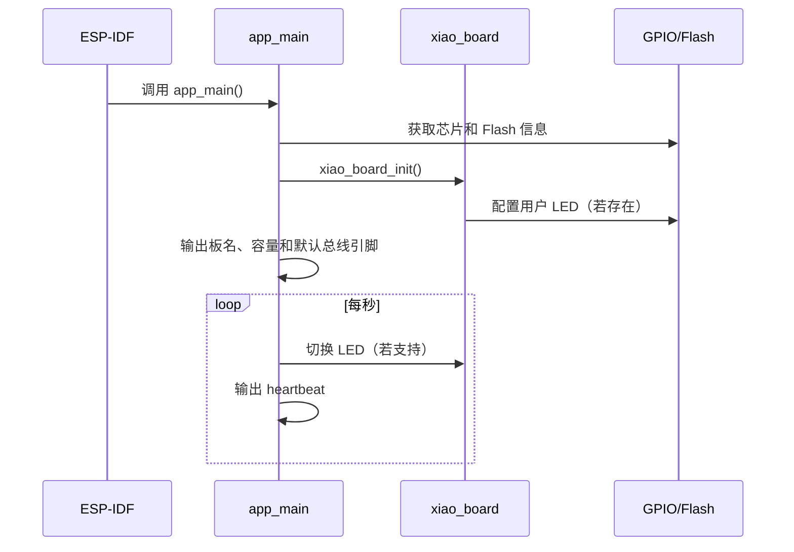

# 固件架构

## 目录职责

```text
src/                 应用入口（main.c：LED 心跳 + 环境自检）
include/             板级公共头文件（xiao_pins.h）
components/          ESP-IDF 自定义组件
  xiao_board/        板级支持：用户 LED 与板级信息 API（首个外设组件的参照）
docs/                项目文档（peripherals/_template.md 为外设页模板，不参与构建）
platformio.ini       开发板环境与构建配置
sdkconfig.defaults   可复现的 ESP-IDF 默认配置
sdkconfig.flash-4mb  C3/C6 的 4 MB Flash 配置
sdkconfig.xiao-esp32s3  S3 的 8 MB Flash 与 Octal PSRAM 配置
```

初始固件版本在根目录 `CMakeLists.txt` 中设置为 `0.1.0`，变更记录见 `CHANGELOG.md`。发布新版本时同步更新 `PROJECT_VER`、`CHANGELOG.md` 和 Git Tag。

外围设备驱动建议放入 `components/<device>/`，并复制 `docs/peripherals/_template.md` 建立 `docs/peripherals/<device>.md`。公共 API 放在组件的 `include/` 中。

## 启动路径



当前 `src/main.c` 是环境自检程序，不是产品业务逻辑。新功能应保留“启动失败可观察”的原则：初始化返回 `esp_err_t`，关键错误带组件 TAG，后台任务有明确的生命周期。

## 板级支持 API

`components/xiao_board/include/xiao_board.h` 暴露：

| API | 作用 | 失败行为 |
|---|---|---|
| `xiao_board_name()` | 返回编译目标的可读板名 | 不失败 |
| `xiao_board_has_user_led()` | 判断该板型是否有应用可控用户 LED | 不失败 |
| `xiao_board_init()` | 初始化板级资源 | GPIO 错误以 `esp_err_t` 返回 |
| `xiao_board_led_set(on)` | 设置低电平有效 LED | 无 LED 时返回 `ESP_ERR_NOT_SUPPORTED` |
| `xiao_board_led_toggle()` | 切换 LED | 无 LED 时返回 `ESP_ERR_NOT_SUPPORTED` |

C3 基础版的 `XIAO_USER_LED` 为 `-1`，因此初始化成功但 LED API 不支持；应用不应把这当成板卡故障。

## 组件设计规则

- 一个组件负责一个设备或一个清晰领域，不把 Wi-Fi、传感器和 UI 混在同一驱动。
- 公共头文件只暴露稳定类型和函数，芯片寄存器/总线细节留在 `.c` 文件。
- 创建函数接收配置并返回 handle；释放函数能够处理部分初始化状态。
- 超时、重试和恢复策略由调用方可配置，不在底层无限阻塞。
- 日志不输出 Wi-Fi 密码、令牌、证书私钥或设备密钥。
- 组件 `CMakeLists.txt` 明确列出 `REQUIRES`/`PRIV_REQUIRES`，不依赖偶然的传递依赖。

## FreeRTOS 边界

ESP-IDF 已集成 FreeRTOS。任务间通过 queue、event group、notification 或受保护的共享状态通信；中断中只做最小工作，把耗时处理交给任务。为每个任务记录：栈大小、优先级、阻塞点、看门狗要求和退出方式。

只有 S3 是双核。共享代码不能假设 C3/C6 也能做同样的核心绑定；优先让调度器分配任务，确有测量证据时再使用 affinity。
